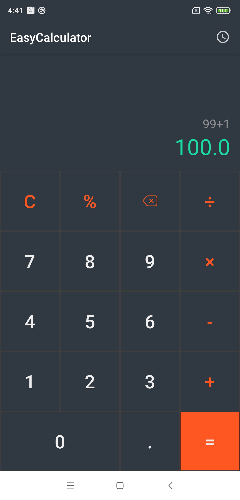
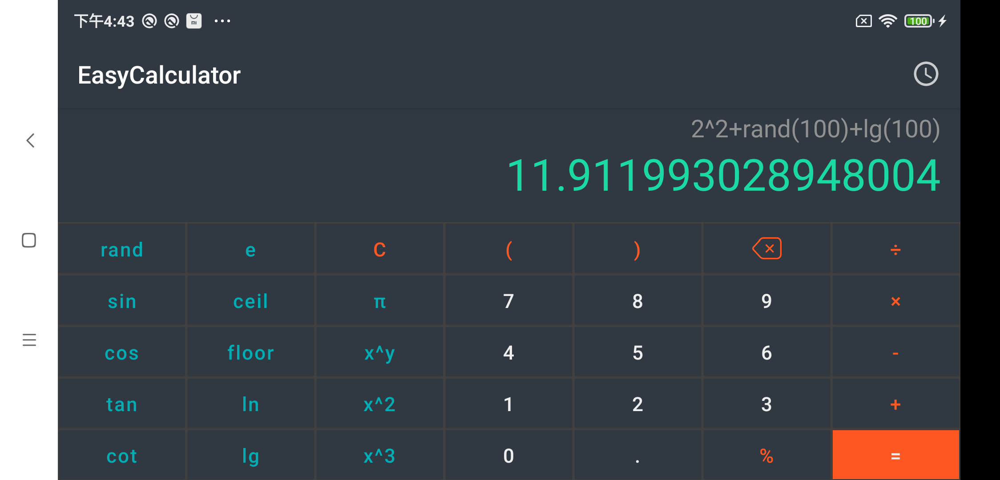

EasyCalculator
=====
EasyCalculator是一款基于Jetpack Compose开发的计算器应用。

应用支持横竖屏两种模式。横屏模式下为用户提供基本的加减乘除运算，竖屏模式下为用户提供常用的科学计算功能，如：指数运算、三角函数、随机函数等

除了输入以外，用户还通过右上角的“历史记录”按钮可以查看之前的计算结果，并可以选取进行记录进行二次计算。

科学计算库
--------
exp4j-0.4.8

用到的素材许可证
--------
cc0
